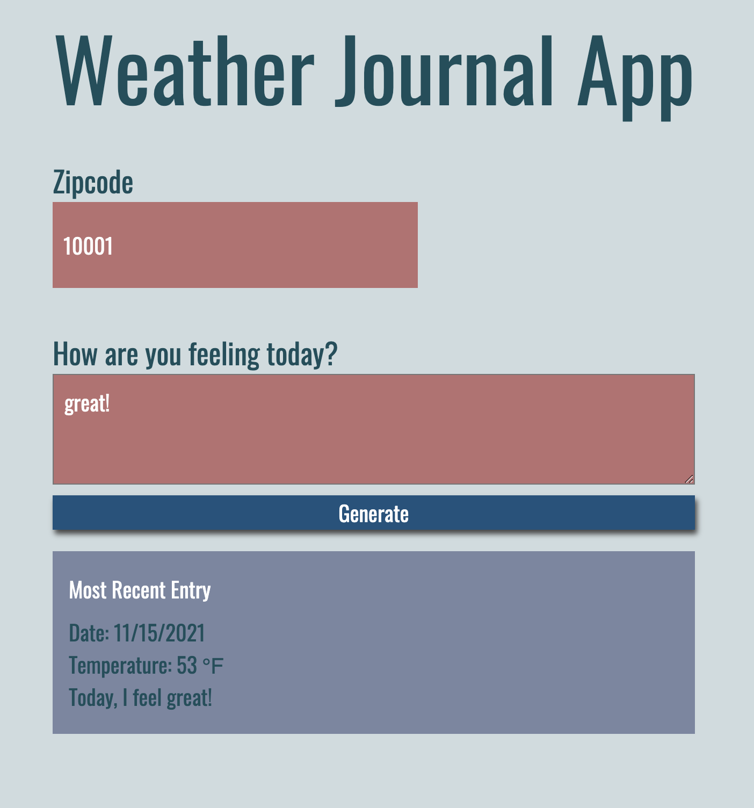

# Project #3: Weather Journal App

## Table of Contents

- [ Project Summary ](#ProjectSummary)
- [ Languages Used](#LanguagesUsed)
- [ Node Modules Used](#NodeModulesUsed)
- [ References/Credit](#References/Credit)
- [ Result](#Result)

## Project Summary

Create an asynchronous web application that utilizes the OpenWeatherMap API to retrieve weather based on a user's zipcode and dynamically update the User Interface accordingly.

<!--
If you want to continue coding you need to have nodejs and npm locally installed. You can check that by running node -v && npm -v in the terminal, which should result in two versions shown in the terminal.

Once nodejs and npm installed you simple run npm start which runs a express server locally and serves the static files. In addition in enables two endpoints. One is a get for projectdata and the second for post projectdata. -->

1. Make sure `node` is installed
   Setting up project environment, making sure I have Node and packages installed, and included in my server.js file.
   Added POST and GET routes to ensure correct retrieval of data from the server.
   Acquired API credentials from OpenWeatherMap website.
   Created async functions to fetch weather data and store it on my local server.
   Set up a function that updated UI dynamically.

## Languages Used

- HTML
- CSS
- JavaScript

## Node Modules Used

- Express
- BodyParser
- Cors

## References/Credit

- https://openweathermap.org/appid

## Result

<!-- [Image of Final Project](./demo.png) -->

